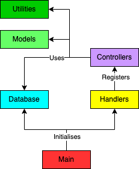
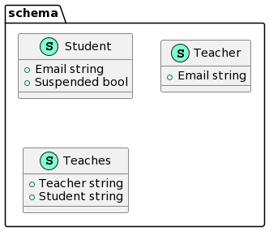
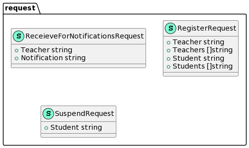
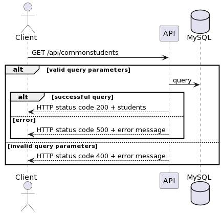
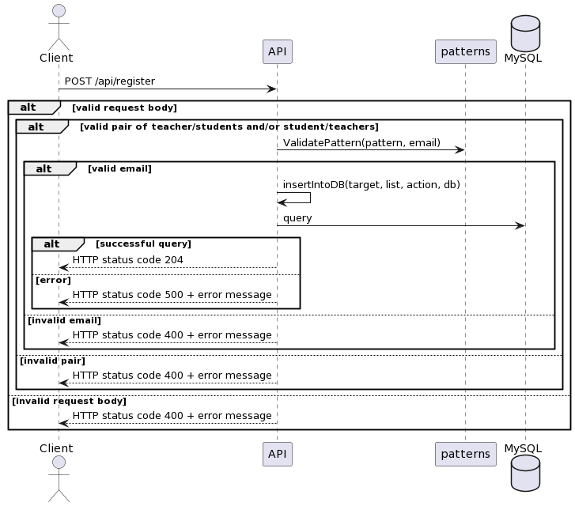
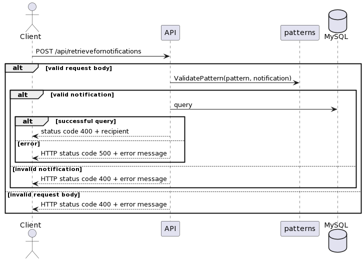
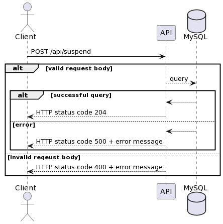
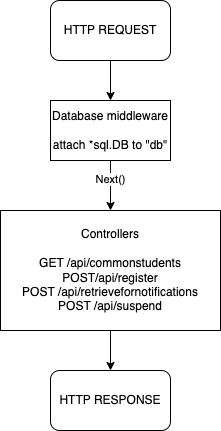
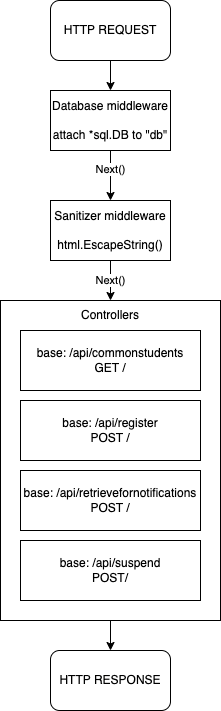

<h1><a href="https://github.com/cwq2326/govtech">Assignment Repo</a></h1>


## Table of Contents

* Table of Contents
{:toc}

## Introduction

### Overview/Background
Teachers need a system where they can perform administrative functions for
their students. Teachers and students are identified by their email addresses.<br>

### Task
Develop a set of API endpoints, listed under User Stories below, for teachers to perform
administrative functions for their classes.<br>

### User stories
1. As a teacher, I want to register one or more students to a specified teacher.
2. As a teacher, I want to retrieve a list of students common to a given list of teachers (i.e. retrieve
   students who are registered to ALL of the given teachers).
3. As a teacher, I want to suspend a specified student.
4. As a teacher, I want to retrieve a list of students who can receive a given notification.

### Use cases

#### UC 1 and 2
* System: RESTful API server
* Use case: UC1 - Registering one or more students to a specified teacher
* Actor: Teacher
* MSS:
  1. User makes a request to the server
  2. Server returns a response
  3. User receives HTTP status code

* Extensions:
  1a.
  * Server receives an invalid request
  * Use case resumes from step 3

* System: RESTful API server
* Use case: UC2 - Registering one or more teachers to a specified student
* Actor: Teacher
* MSS:
  1. User makes a request to the server
  2. Server returns a response
  3. User receives HTTP status code

* Extensions:
  1a.
  * Server receives an invalid request
  * Use case resumes from step 3

#### UC3
* System: RESTful API server
* Use case: UC3 - Retrieving a list of students common to a given list of teachers
* Actor: Teacher
* MSS:
  1. User makes a request to the server
  2. Server returns a response with a list of students common to the teachers specified in the response
  3. User receives HTTP status code and response body

* Extensions:
  1a.
  * Server receives an invalid request
  * Use case resumes from step 3

#### UC4
* System: RESTful API server
* Use case: UC4 - Suspending a specified student
* Actor: Teacher
* MSS:
  1. User makes a request to the server
  2. Server returns a response
  3. User receives HTTP status code

* Extensions:
  1a.
  * Server receives an invalid request
  * Use case resumes from step 3

#### UC5

* System: RESTful API server
* Use case: UC5 - Retrieving a list of students who can receive a given notification
* Actor: Teacher
* MSS:
  1. User makes a request to the server
  2. Server returns a response
  3. User receives HTTP status code

* Extensions:
  1a.
  * Server receives an invalid request
  * Use case resumes from step 3

### Tech stacks
1. Golang
2. Gin Gonic
3. MySQL/ Microsoft Azure MySQL
4. GitHub Actions

## Design decisions

### High-level design


### Architecture pattern
The architecture pattern used for this assignment is the `MVC` pattern.
* `Model` - relations (teachers, students, teaches) and request bodies <br>
* `View` - JSON response bodies sent back to the client's response <br>
* `Controller` - handles incoming request and defines the logic of each endpoints, interacting with the model and generating appropriate JSON response bodies <br>

### Entity Relationship Model
* Teacher and student's email are used as primary keys since they are identified by their emails
* Teaches is a Many-to-Many relationship between the teachers and students, requiring the entities to have total participation<br>


### Design principles

#### Single Responsibility Principle
* Each controller file in `controllers` package contains the logic to handle incoming request for its respective endpoints.

#### Separations of Concerns
* `MVC` architecture pattern
* Code is split into different packages with its own purposes

```
├── pkg
│   ├── controllers
│   │   ├── commonstudents.go
│   │   ├── register.go
│   │   ├── retrievefornotifications.go
│   │   └── suspend.go
│   ├── models
│   │   ├── request
│   │   │   ├── register.go
│   │   │   ├── retrievefornotifications.go
│   │   │   └── suspend.go
│   │   └── schema
│   │       ├── student.go
│   │       ├── teacher.go
│   │       └── teaches.go
│   ├── server
│   │   ├── databases
│   │   │   └── mysql.go
│   │   └── handlers
│   │       ├── middlewares
│   │       │   └── database.go
│   │       └── router.go
│   └── utilities
│       ├── messages
│       │   ├── error.go
│       │   └── register.go
│       ├── patterns
│       │   └── patterns.go
│       └── set
│           └── set.go
```

#### Open-Close Principle
* Endpoints are extensible
  * Add the controller for that endpoint to the `RegisterEndPoint()` function
  * Add it to `router.go` if not already exist

#### Don't Repeat Yourself (DRY) Principle
* The same error messages in `error.go` are used by the controllers
* Functions to generate error messages for the endpoints in `error.go`

```
// error.go
const MESSAGE_DATABASE_ERROR = "Failed to query database record. Contact the administrator for more information."

func GetErrorMessage(err error) (gin.H, string) {
	var validationError validator.ValidationErrors
	var unmarshalTypeError *json.UnmarshalTypeError

	if errors.As(err, &validationError) {
		return gin.H{MESSAGE_MISSING_PARAMS: MissingParamsMessage(validationError)}, ""
	} else if errors.As(err, &unmarshalTypeError) {
		return gin.H{MESSAGE_MISSING_PARAMS: TypeErrorParamsMessage(*unmarshalTypeError)}, ""
	} else {
		return nil, "One or more required fields are missing or invalid."
	}
}
```
## Implementations

### Models

#### Translating entity relationship model
<br>

Translating the entity relationship model to a schema:
* Teachers (<u>email</u> text)
* Students (<u>email</u> text, suspended boolean)
* Teaches (<u>teacher</u> text, <u>student</u> text)

And then translating them into relations:
* `CREATE TABLE Teachers (email VARCHAR(255) PRIMARY KEY)`
* `CREATE TABLE Students (email VARCHAR(255) PRIMARY KEY,  suspended TINYINT(1))`
* `CREATE TABLE Teaches (teacher VARCHAR(255), student VARCHAR(255), PRIMARY KEY(teacher,student), FOREIGN KEY (teacher) REFERENCES Teachers(email) ON DELETE CASCADE, FOREIGN KEY (student) REFERENCES Students(email) ON DELETE CASCADE)`



Structure for response body for binding to gin.Context in the controllers


### Views
* Since this is a RESTful backend applicaiton, there is no UI/ frontend aspects of things, therefore the view can be thought of the JSON formatted response returned to the client
<br>

An example of an error response<br>


### Controllers (API endpoints)

#### GET /api/commonstudents

#### Parameters

| Name | Type | In | Required | Description |
| ---  | ---  | -- | -------- | ----------- |
| teacher | string | Query | false | Email of the teacher |

#### Implementation details
* Checks for query parameters using `gin.Context.QueryArray("teacher")`
  * Returns error if length of array is 0
* Uses SQL `SELECT` and `INTERSECT` queries to get students which are common to all teacher(s)
  * Query string is built while looping through the array of teachers

#### Sequence diagram


#### POST /api/register

#### Parameters

| Name | Type | Mandatory | Description |
| ---  | ---  | -------- | ----------- |
| teacher | string | false | Email of the teacher. This and the students parameter are required if registering one or more students to a specified teacher. The mentioned pair of parameters are not required if there is already a pair of student and teachers. Both pairs can be present. |
| students | string | false | List of student emails. This and the teacher parameter are required if registering one or more students to a specified teacher. The mentioned pair of parameters are not required if there is already a pair of student and teachers. Both pairs can be present. |
| student | string | false | Email of the student. This and the teachers parameter are required if registering one or more students to a specified teacher. The mentioned pair of parameters are not required if there is already a pair of teacher and students. Both pairs can be present. |
| teachers | string | false | List of teacher emails. This and the student parameter are required if registering one or more students to a specified teacher. The mentioned pair of parameters are not required if there is already a pair of teacher and students. Both pairs can be present. |

#### Implementation details
* Checks for valid teacher/students and student/teachers pair
  * Valid pair means length of students/teachers > 0 and teacher/student present and is of correct email format
  * Does not return error if at least one valid pair is present
  * Inserts data into all 3 tables (teachers/ students/ teaches)

#### Sequence diagram


#### POST /api/retrievefornotifications

#### Parameters

| Name | Type | Required | Description |
| ---  | ---  | -------- | ----------- |
| teacher | string  | true | Email of the teacher. |
| notification | string | true | Message to send to students. The notification must be in the format of `<message>_<@email>*` where _ represents a space and * represents any number of tagged emails. The message is alphanumeric and can contain spaces and punctuations. |

#### Implementation details
* Checks for valid notification message
  * Valid notification message follows the regexp pattern `^([a-zA-Z0-9_.,!?-]+\s?)*(@[a-zA-Z0-9._%+-]+@[a-zA-Z0-9.-]+\.[a-zA-Z]{2,}\s*)*$`
* Set data structure is used to prevent duplicate students

#### Sequence diagram


#### POST /api/suspend

#### Parameters
	
| Name | Type | Required | Description |
| ---  | ---  | -------- | ----------- |
| student | string  | true | Email of the student. |
	
#### Implementation details
* Uses `UPDATE` query to suspend the student by setting `suspend` to `1`

#### Sequence diagram


### Gin middleware stack

* Middleware stack consists of a database middleware, which attaches an instance of a SQL db to the value "db"
  * This is so the controllers at the endpoints can use this db instance 
<br>


	
### Secure coding practices
* Using parameterized query `db.Query()` instead of `db.Exec()` to escape input, thus preventing SQL injections
* Character limit to prevent buffer overflow
* Validation of inputs such as `email` and `notification` to preseve data integrity

### Unit testings
* Implemented unit testing for API endpoints and regexp patterns in `utilities` package
* A test database is used as a stub to simulate interaction of API endpoints with the live database
* Test cases are designed using black block specifications
  * API endpoints and utilities functions are tested based on expected input and behavior of output
  * For example, `POST /api/suspend` should return HTTP status code 204 for a successful request
    1. Insert an entry into the test database with a unsuspended student
    2. Make a valid request to the endpoint
    3. Assert HTTP status code = 204 and check that suspended = 1 for that student via `SELECT` query
	
```
// This entry is used as a stub model
_, err = db.Exec(`INSERT INTO students VALUES ("test@gmail.com", 0)`)
	
// Send valid request body to /api/suspend
payload := request.SuspendRequest{
    Student: "test@gmail.com",
}

jsonValue, _ := json.Marshal(payload)
req, _ := http.NewRequest("POST", "/api/suspend", bytes.NewBuffer(jsonValue))
rr := httptest.NewRecorder()
r.ServeHTTP(rr, req)

// Assert that HTTP status code is equals to 204
assert.Equal(t, http.StatusNoContent, rr.Code)

// Check that student is suspended
var suspended int
err = db.QueryRow(`SELECT suspended FROM students WHERE email = ?`, "test@gmail.com").Scan(&suspended)
if err != nil {
	t.Fatal(err.Error())
}
assert.Equal(t, 1, suspended)
	
```
  * Using equivalence partitions technique
    * CommonStudents(t *testing.T) in api_test.go<br>

| Specification | Equivalence partitions |
| ------------- | ---------------------- |
| Returns list of students common to a list of teachers specified and http status code 200 if "teacher" query parameters is present | [at least 1 query parameter "teacher" is present]<br>[no query paremeter "teacher" is present] | 

  * Using no more than one invalid input in a test case
    * Register(t *testing.t) in api_test.go<br>
 
| Teacher | Students | Student | Teachers | Outcome |
| ------- | -------- | ------- | -------- | ------- |
| valid   | valid    | omit   | omit     | success |
| omit    | omit    | valid  | valid   | success |
| valid  | valid   | valid  | valid  | success |
| valid  | invalid | omit   | omit    | error  |
| invalid | valid   | omit   | omit    | error  |
| omit   | omit    | valid  | invalid  | error   |
| omit   | omit   | invalid | valid   | error  |
| omit   | omit   | omit | omit | error |

### Continuous Integration
* GitHub Actions is used to implement CI workflow
* Automated testing upon every push to main
  1. User push commits to main branch on GitHub
  2. GitHub Actions triggers build and run tests using Azure MySQL


## Improvements/ Alternatives

### Gin middleware stack


### Making the database package more extensible
```
// create a database interface which contains methods that all database struct should have
type Database[T] interface {
    ConnectDB() T
    DisconnectDB()
    InitDB()
    QueryDB() interface, error
}

// mysql.go
type MySQL struct {
  Config MySqlConfig
}

func (db *MySQL) ConnectDB() *sql.DB {
    // connect to db
    if err != nil {
		panic(err.Error())
	} else {
		fmt.Println("Successfully connected to database")
		return db
	}
}

// mongodb.go
type MongoDB struct {
  Config MongoDBConfig
}

func (db *MongoDB) ConnectDB() *mongo.Client  {
    // connect to db
    if err != nil {
		panic(err.Error())
	} else {
		fmt.Println("Successfully connected to database")
		return db
	}
}
```

### Design Patterns
* Use `Singleton` design pattern to get instance of database instead of passing it as a value in the middleware stack
	
```
// mysql.go

var db *sql.DB
	
func init() {
    var err error
    dsn := fmt.Sprintf("%s:%s@tcp(%s:%s)/%s", config.User, config.Password,
		config.Host, config.Port, config.Name)
    
    db, err = sql.Open("mysql", dsn)
    if err != nil {
	panic(err.Error())
    }
}
	
func getDB() *sql.DB {
    return db	
}
```

### Continuous Integration
* Build on other OS eg. MacOS, Windows, other Unix variants
  * Currently, it is only built on Ubuntu

### Continuous Deployment (CD)
* Set up a CD workflow to deploy to a cloud provider such as AWS or Azure

### Unit Testing
* Implement test cases using white box specifications
* Implement test cases for the rest of the utilities functions
* Verifying correct email format for teachers in CommonStudents() in api_test.go, and updating the equivalence partitions<br>

| Specification | Equivalence partitions |
| ------------- | ---------------------- |
| Returns list of students common to a list of teachers specified and http status code 200 if "teacher" query parameters is present | [at least 1 query parameter "teacher" is present and all in correct email format]<br>[at least 1 query parameter "teacher" is present and at least 1 incorrect email format]<br>[at least 1 query parameter "teacher" is present and all incorrect email format]<br>[no query paremeter "teacher" is present] | 

### Secure coding practices
* Escape string in query for commonstudents.go

```
// commonstudents.go

// Build query string to get students registered to all teachers in the list.
	for i, v := range teachers {
		if i > 0 {
			query += " INTERSECT "
		}
		query += `SELECT student
				  FROM teaches
				  WHERE teacher = "` + html.EscapeString(v) + `"`
	}
```

### Code Refactoring
* Add in request type for API endpoints eg. `postSuspend()` instead of `Suspend()`
* Standardise amount of characters for email in SQL relations and request body model structure
* Using `panic()` when there is a query error in the controllers function, and using `recover()` to recover from it. This helps to reinfoce the DRY principle.
